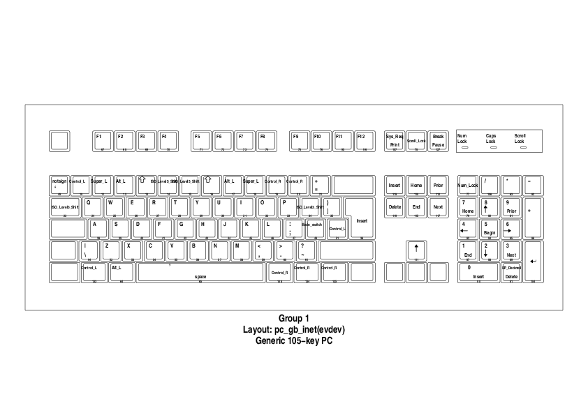
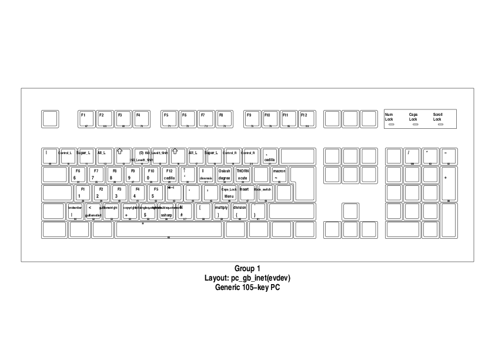
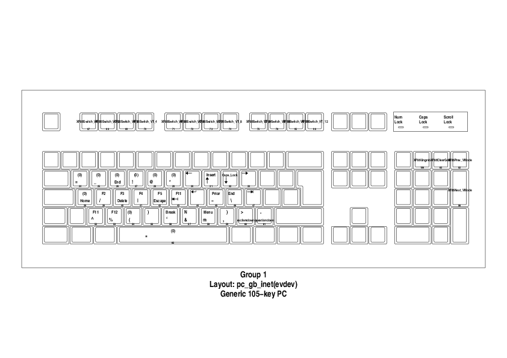

# Symbolboard2

An ergonomic keyboard layout for linux (and [mac](https://github.com/talwrii/symbolboard-mac)).
Provides many of the benefits of split, ergonomic keyboard with custom modifiers like the kinesis without having to buy, transport and use such a keyboard.

Symbolboard2 is as an xkb keyboard map to create a keyboard layout that is meant to be both ergonomic and consistent with all keyboard types -  particularly laptops which may move symbolkeys arouund.
This is acheived by placing modifier keys where the number keys, mirrored on each side of the keyboard to avoid stretched hand positions. New modifier keys are created for symbols and numbers and placed on the number row.

# What is wrong with "normal keyboards"?
The normal placing of modifiers (super, alt, ctrl etc) can require you to make your hands in line with the keys and stretch to press a modifier and a key at the same time. Over time this can create hand strain and require one to twist your wrist. See [this advice by kinesis on the topic](https://kinesis-ergo.com/split-keyboards/).

This layout by virtue of not requireing you to press symbol keys and placing all modifiers on the numbers allows you to angle your elbows in avoiding any twist - since it is natural to press numbers in this way.

# xmodmap
This is a successor to u [symbolboard](https://github.com/talwrii/symbolboard) that I used for a number of years and is based on xmodmap. However, I found issues with "cross platform" pieces of software like google chrome and obsidian, these acted as though they were always holding down the "ModeSwitch" button which broke this layout. These issues were resolved using the standard xkb layout.

# Installing

* Clone this repo.
* Run `./load`
* Optionally do this by default when you log in.

# Mappings

You can look in [this file](./symbolboard) to understand mappings.
Pay particular attention to ISO_Level3_Shift, and ISO_Level5_Shift which are the modifier keys.
See also `zathura <(xkbprint :0 -o - | ps2pdf -).`

## Default mappings

## Mappings with iso level 3 shift

## Mappings with iso level 5 shift

